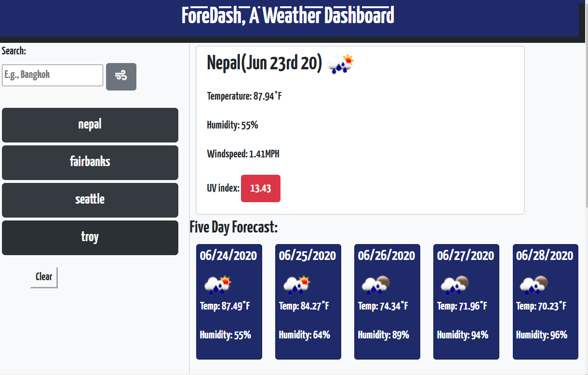
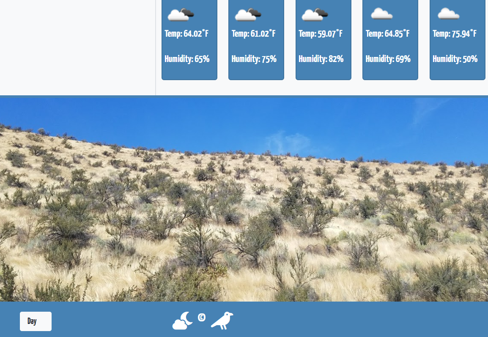

# Local-Weather-Dash

App page that uses 3rd party API retrieval to generate a localized custom weather dashboard.

 - deployed link: https://epachols.github.io/Local-Weather-Dash/
 
# User can see the weather outlook for multiple cities so they may plan a trip accordingly.

- A weather dashboard with form inputs
- WHEN one searches for a city
- THEN one is provided current and future conditions for that city and that city is added to the search history
- conditions returned:
- City name, current date, current weather conditions, temperature in F, humidity%, UV index, and wind speed.
- WHEN one views the UV index
- THEN one is presented with a color that indicates whether the conditions are favorable, moderate, or severe
- WHEN one views future weather conditions for that city
- THEN one is presented with a 5-day forecast that displays the date, an icon representation of weather conditions, the temperature, and the humidity
- WHEN one clicks on a city in the search history
- THEN one is again presented with current and future conditions for that city
- WHEN one opens the weather dashboard
- THEN one is presented with the last searched city forecast

- The app toggles between day/night mode either via the toggle in the bottom corner or at the time of page load.
- WHEN one clicks the clear button, it clears search history in local storage for the user and re-renders a blank page.

